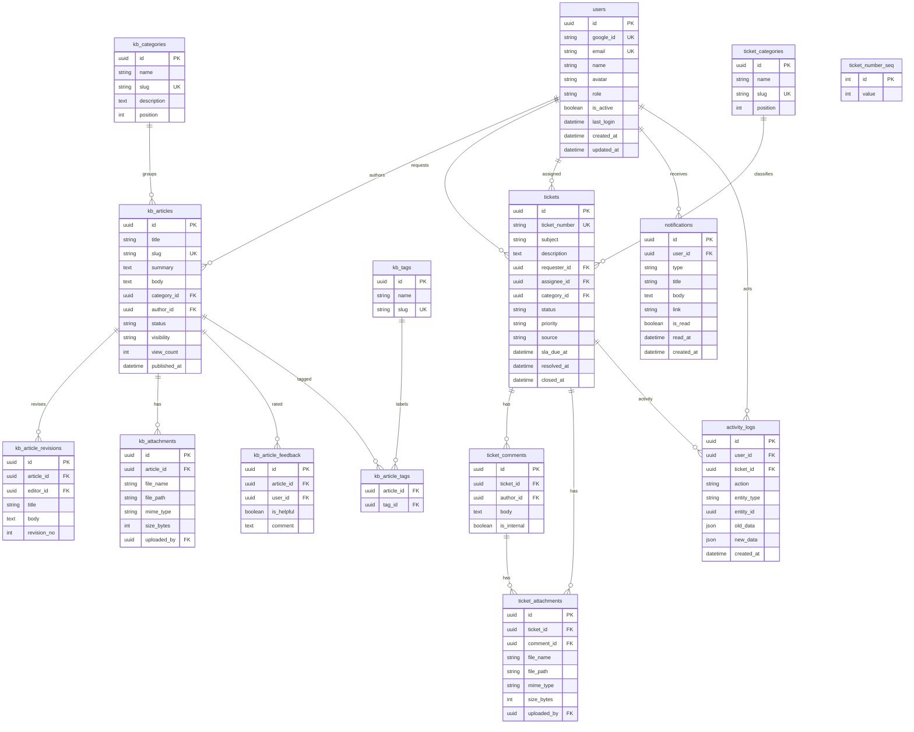

# ERD

Entity relationship diagram (MermaidJS).

## Notes

- UUID primary keys, PostgreSQL naming conventions; `created_at`/`updated_at` on most tables.
- Enums are stored as `VARCHAR` with check constraints (`native_enum=False`) for SQLite/Postgres parity.
- `activity_logs.entity_type` + `entity_id` reference any record (loose, not a hard FK).
- `ticket_number_seq` is a single-row counter for `TKT-000123` numbers.
- Indexes: tickets `(status, updated_at)`, `(assignee_id, status)`, `(sla_due_at)`;
  notifications `(user_id, is_read, created_at)`; activity `(entity_type, entity_id)`, `(created_at)`.
